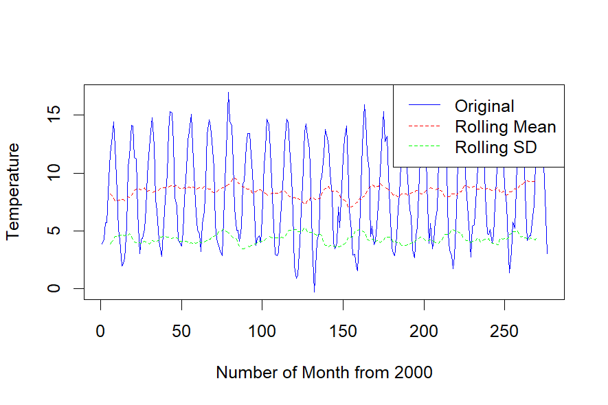
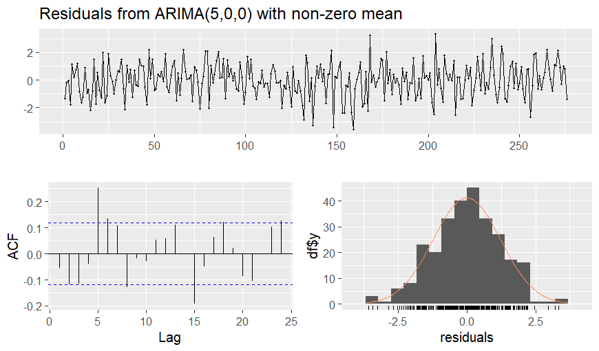

# Tutorial aims 

The aim of this tutorial is to provide a comprehensive and approachable guide to time series analysis and forecasting using temperature data in Edinburgh. This tutorial is designed for advanced undergraduate or early graduate students in Environmental or Ecological Sciences who are looking to enhance their data science skills. By the end of this tutorial, learners will:

- Understand the fundamental concepts of time series analysis, including decomposition, stationarity, and autocorrelation.
- Gain hands-on experience in using R to preprocess, analyse, and forecast time series data.
- Learn how to assess and improve model performance and interpret forecasting results effectively.
- Apply these techniques to real-world problems to understand climate trends and predict environmental changes.

---

# Tutorial steps
#### 1. Introduction

### Part I: Data Preparation and Exploration
#### 2. Data Preparation
a) Load the dataset.
b) Clean and organise the dataset.

### Part II: Analyzing Time Series and Assumptions Check
#### 3. Visualization of data

#### 4. Decomposing Time Series

#### 5. Check important assumptions
a) Stationarity Check
b) Normality of Residual Check

### Part III: Forecasting

#### 6. Select an appropriate forecasting model

#### 7. Generate forecasts
a) Forecasting the temperature next year (the next 12 months)
b) (Optional) Compare the forecasted temperature with real-world temperature

#### 8. Evaluate the model's performance

#### 9. (Optional) Forecasting the temperature for the next 5 years (the next 60 months)

### (Optional) Part IV: Challenges
#### 10: Analyse whether there is a long-term trend in the temperature data and assess its impact on the forecasting model

---

## 1. Introduction

Time series data is ubiquitous in environmental and ecological sciences, from monitoring weather patterns to analyzing biodiversity trends. This tutorial focuses on the monthly average temperatures in Edinburgh from 2000 to 2022, offering a real-world application of time series analysis. With increasing awareness of climate change and its impact on ecosystems, analysing temperature trends can provide critical insights for researchers, policymakers, and urban planners.

This tutorial will take you step-by-step through the process of time series analysis, starting with data preprocessing and exploration, followed by decomposition and statistical analysis, and concluding with forecasting future trends using ARIMA models. Along the way, we will discuss key assumptions, model diagnostics, and evaluation metrics to ensure robust analysis.

Whether you are new to time series analysis or seeking to deepen your expertise, this tutorial provides a practical foundation in handling real-world environmental data using R. Let’s get started on exploring the story hidden within the temperature data of Edinburgh!

<div style="background-color: #d9edf7; padding: 10px; border-radius: 5px;">
> ***_NOTE:_*** Note that this tutorial will assume that you already have previous experience with R and familiar with basic operations of R such as `%>%` and `summarise()`. If not, Coding Club has got you covered: check out the [Intro to R tutorial](https://ourcodingclub.github.io/tutorials/intro-to-r/)!
</div>

# _Part I: Data Preparation and Exploration_
## 2. Data Wrangling
### (a) Load the dataset
In this tutorial, we will use a dataset obtained from the **NASA POWER API**, a tool that provides climate data from NASA's Prediction of Worldwide Energy Resource (POWER) project. Specifically, we will use monthly temperature data (measured at 2 meters above the ground) of Edinburgh (by using Edinburgh's location coordinates: Longitude: 3.1883°W & Latitude: 55.9533°N) for the years 2000 to 2022. 
We first download the relevant packages using the following code:
```r
# Relevant packages
# Need to download them if you haven't already
library(ggplot2)
library(forecast)
library(dplyr)
library(nasapower)
library(lubridate)
```

Now let's load the dataset and name it `temp_data`. Note that we want the location to be Edinburgh so, we need to enter Edinburgh's coordinate of location. 

```r
temp_data <- get_power(
  community = "AG",
  lonlat = c(-3.1883,55.9533),   # Edinburgh's Longitude and Latitude
  pars = "T2M",      # Temperature at 2 meters
  temporal_api = "monthly",
  dates = c("2000", "2022")
)
```

### (b) Clean and organise the dataset
Now we have the dataset, but is it in a ideal form for doing time series analysis? An ideal dataset for time series analysis has specific characteristics that make it well-suited for extracting meaningful patterns and developing accurate models:

**- Consistent Time Intervals:** Regular intervals ensure that the dataset captures temporal patterns like trends, seasonality, or cyclic behavior accurately. Irregular intervals make it difficult to apply standard time series models. 

**- No Missing Values:** Missing values can lead to incorrect analysis, such as distorted trends or seasonal patterns. If unavoidable, missing values should be deleted or handled appropriately.

**- Sufficient Length of Historical Data:** Time series models rely on past data to predict future values. A longer dataset allows for better detection of trends, seasonality, and rare events (e.g., economic recessions or climate changes).

**- Clear labels for time periods:** Properly labeled time points make it easier to interpret results and ensure that models process the data correctly. 

These are some basic characteristics of a dataset that are ideal for doing timer series analysis. Without these characteristics, the quality and reliability of the analysis may suffer. 

<div style="background-color: #d9edf7; padding: 10px; border-radius: 5px;">
Note that more requirements may apply to the dataset, depending on the aims of analysis.
</div>

Now let's check what our dataset looks like by running `head(temp_data)`. We can see that the dataset is in a wide format, with months as separate columns. This structure is not ideal for time series analysis, where data should be in long format with a single date column. Also, we do not need columns such as `LON`, `LAT`, and `PARAMETER` are repeated and not provide valuable information. Moreover, the column names for months (JAN, FEB, etc.) use abbreviations, which need to be converted into numbers or used to generate a proper date. 

Based on these information and the characteristics, clean and make the dataset as what we wanted in the following code chunk! Consider this as a warm-up!
```r 
# Write your code here (or somewhere else)!


```
If you are ready, check the solution by clicking the button below!

<div style="background-color: #FFF9C4; padding: 10px; border-radius: 5px;">
<details> <summary>Click here for the solution!</summary>

```r
# Clean the dataset
temp_data <- temp_data %>%
  # Reshape from wide to long format
  pivot_longer(
    cols = JAN:DEC, # Ensure column names match exactly
    names_to = "MONTH",
    values_to = "TEMPERATURE"
  ) %>%
  # Convert MONTH abbreviations to numbers
  mutate(
    MONTH = match(toupper(MONTH), toupper(month.abb)),
    YEAR_MONTH = paste(YEAR, MONTH, sep = "-") # Create 'YEAR-MONTH' column
  ) %>%
  mutate(YEAR_MONTH = ym(YEAR_MONTH)) %>% # Convert "YEAR-MONTH" to date
  # Select only the relevant columns for time series analysis
  select(YEAR_MONTH, TEMPERATURE)
```
</details>
</div>


Run the `head(temp_data)` again and see what it looks like now. Now it is in long format and has only two columns: `YEAR_MONTH` and `TEMPERATURE`.  This is a fairly simple dataset but ideal for time series analysis! Note that we haven't check if there is missing values in the dataset, we can do this by running the following code which count the number of missing values in the entire dataset:

```r
sum(is.na(temp_data))
```


It's 0! This means there is no missing value in our dataset. We are good to go!

# _Part II: Analyzing Time Series_
## 3. Visualization of data
We can start by displaying the temperature trends over time and see what the plot looks like. We can simply use the `ggplot()` to do this for us:
```r
ggplot(temp_data, aes(x = YEAR_MONTH, y = TEMPERATURE)) +
  geom_line() +
  labs(
    title = "Temperature Trends Over Time",
    x = "Year-Month",
    y = "Temperature"
  )
```

<center></center>


We can clearly see that the temperature exhibits a clear seasonal pattern, with regular fluctuations that likely correspond to yearly changes (e.g., summer and winter cycles). The recurring peaks represent warmer months, while the troughs correspond to cooler months, highlighting predictable seasonal variability. Also, there does not appear to be a significant long-term upward or downward trend, suggesting relative stability in Edinburgh's average temperature from 2000 to the end of 2020. 

## 4. Decomposing Time Series:
The previous plot provides an overview of the temperature trends over time, showing clear seasonal fluctuations and variations. However, to better understand the underlying components—such as the overall trend, recurring seasonal patterns and random fluctuations, we can decompose the time series. Decomposition helps us isolate these components, enabling a more detailed analysis of the data. Using the `stl()` function from the `forecast` library, we can decompose our dataset:
```r
ts_data <- ts(temp_data$TEMPERATURE, start = c(2000, 1), frequency = 12)

# Apply STL decomposition (Seasonal and Trend decomposition)
decomposed_stl <- stl(ts_data, s.window = "periodic")
plot(decomposed_stl, main = "STL Decomposition of the Data")
```
<div style="background-color: #d9edf7;; padding: 10px; border-radius: 5px;">
The `ts` function converts our temperature data into a time series object and the `stl` function performs seasonal and trend decomposition (note that here we use `s.window = "periodic"` to assume a fixed seasonal pattern in the dataset). 
</details>
</div>

Run the code and we will get the plot below:

<center></center>


There dataset is decomposed into the following four panels:

**- Data (Observed Time Series):** The top panel represents the original temperature data, which shows both seasonal patterns and an underlying trend. This is just what we have in the plot `Temperature Trends Over Time`. 

**- Seasonal Component:** The second panel highlights the seasonal component, which is consistent across the years. The periodic fluctuations indicate clear seasonality in the dataset, with similar highs and lows repeating each year. This is typical for most temperature datasets, where warmer and cooler months recur annually.

**- Trend Component:** The third panel shows the trend component, which represents the long-term changes in temperature. There are periods of increase and decrease in temperature over the years, reflecting underlying climatic changes. Notably, around 2010-2015, there is a slight downward trend, but the trend appears to recover in recent years.

**- Remainder (Random Component):** The fourth panel shows the remainder (random) component, which captures noise or unexplained variations in the data. There are spikes and dips, suggesting anomalies or unusual events that deviate from the expected trend and seasonality of the dataset. These could be due to irregular climatic events such as heatwaves, cold snaps, or measurement errors.

In general, the decomposition shows strong seasonality, which can be leveraged for accurate seasonal forecasting later.

## 5. Check important assumptions
There are some important assumptions to check before going to forecasting (eg, Stationarity, autocorrelation and Independence of Residuals...). In this tutorial, our main focus will be on forecasting so we would not spend much time checking through all the assumptions. Here, we will only check two of the main assumptions: **Stationarity** and **Normality of Residuals** to show you how things work!

> ***_NOTE:_***  If you would like to know what each assumption is and how to check them using R, please refer to this amazing [Youtube video](https://www.youtube.com/watch?v=eTZ4VUZHzxw&t=204s)!

### (a) Stationarity Check
Before we move to part III: Data forecasting, it is important to perform stationary check to our dataset. Stationarity is a fundamental assumption for many time series forecasting methods. A stationary series will show constant mean and variance over time, with no visible trend or seasonality. In our case, we will be using looking at rolling mean and rolling standard deviations. These metrics are computed over a moving window (or "rolling window") of data points. The window slides through the dataset, recalculating the mean or standard deviation for each new position. Here we set the k = 12 for the rolling windows because 12 months is a year. 
A way to check this is to use the rolling mean and standard deviation from the `zoo` library. 
```r
# Compute rolling mean and standard deviation
roll_mean <- zoo::rollmean(temp_data$TEMPERATURE, k = 12, fill = NA)
roll_sd <- zoo::rollapply(temp_data$TEMPERATURE, width = 12, FUN = sd, fill = NA)
```

Then we can visualise it to see if they change over time by running the following code:
```r
plot(temp_data$TEMPERATURE, type = "l", col = "blue", ylab = "Temperature", xlab = "Number of Month from 2000")
lines(roll_mean, col = "red", lty = 2)  # Rolling mean
lines(roll_sd, col = "green", lty = 2)  # Rolling standard deviation
legend("topright", legend = c("Original", "Rolling Mean", "Rolling SD"), col = c("blue", "red", "green"), lty = c(1, 2, 2))
```

Here is the plot, what can we tell from it?

<center></center>

We can see clearly from the plot that the rolling mean indicates a generally consistent trend over time, with some slight variations in its level. The rolling standard deviation is also relatively stable but appears to fluctuate slightly, particularly around certain periods (e.g., after 100 on the x-axis). However, the rolling mean and the rolling standard deviations are all generally constant. This suggests our dataset is mostly stable but may still have non-stationary components, likely because of the seasonal patterns of the data. 

<div style="background-color: #d9edf7; padding: 10px; border-radius: 5px;">
Try `print(roll_mean)` and `print(roll_sd)`, why are there 5 `NA` values at the beginning and the end of them? Hint: think about why we need the `fill = NA` argument when we were computing the rolling mean and rolling standard deviaton.
</div>


<div style="background-color: #FFF9C4; padding: 10px; border-radius: 5px;">
<details> <summary>Click here for the solution!</summary>
The Answer is that: The `zoo::rollmean` function in R calculates the moving average with a specified window size k. When you specify `k = 12`, it calculates the mean over a rolling window of 12 data points. A window size of 12 means that the function requires 12 data points to calculate the first value of the moving average. For the first and last 5 points in your dataset, there aren't enough data points to form a complete window of size 12, and that is why we need to `fill = NA` argument! The `fill = NA` argument ensures that where there aren't enough data points to calculate the moving average, `NA` is inserted instead of a numeric value.
</details>
</div>

### Another (rather formal) way to check stationarity
If you are a math person and feel like looking at the mean and variance visually is not convincing enough, there are several formal ways to reduce your concerns! One of them is the `Augmented Dickey-Fuller (ADF) Test` from the  `tseries` library which checks whether a time series is stationary or not. We can perform the test using the following code

```r
adf.test(temp_data$TEMPERATURE, alternative = "stationary")

```

The test statistic is `-11.987`. This value is compared with critical values from the Dickey-Fuller table. A very negative test statistic (as in this case) strongly indicates that the null hypothesis can be rejected. The null hypothesis assumes that this time series is non-stationary (it has a unit root). Since the p-value is very small (smaller than common significance levels 0.5), we can reject the null hypothesis that the time series it not stable.

### (b) Normality of Residual Check
Another important assumption to check is the Normality of Residual. Two easy ways to check this is through a histogram of residuals and a Q-Q plot, which can be done easily by the following code:
```r
# Check Normality (Histogram)
hist(residuals, main = "Histogram of Residuals", xlab = "Residuals")
```
```r
# Check Normality (Q-Q plot)
qqnorm(residuals)
qqline(residuals, col = "red")
```
Here are the outcomes:

<center></center>

Both plots look good. The histogram on the left shows that the residuals are approximately symmetrically distributed, resembling a normal distribution with a peak near zero. The Q-Q plot on the right further confirms normality, as most points align closely with the red diagonal line, indicating that the residuals follow a theoretical normal distribution. We are good to move to the forecasting now!


# _Part III: Forecasting_

Now that we’ve prepared and analysed our time series data, it’s time to build a forecasting model and generate future predictions! In this section, we will:

**- Select an appropriate forecasting model.** 

**- Generate forecasts for future time points.** 

**- Evaluate the model's performance.** 

**- Visualise and interpret the forecast results.** 


## 6. Select an appropriate forecasting model.
The first step in forecasting is selecting the right model. For this tutorial, we’ll use the ARIMA (Auto-Regressive Integrated Moving Average) model, as it is versatile and works well for time series data with trends and seasonality. Good news for us, R provides the `auto.arima()` function from the `forecast` library, which automatically selects the best ARIMA model for the data by optimizing the parameters:

```r
# Automatically find the best ARIMA model
best_ARIMA_model <- auto.arima(temp_data$TEMPERATURE, seasonal = TRUE)
```
Now run `summary(best_ARIMA_model)`. This will display the selected model's details, including its parameters and diagnostic information. 
```r
# Display the model summary
summary(best_model)
```
We will get a title `ARIMA(5,0,0)` and a summary table containing the following information:

| Term  | Coefficient | SE     |
|-------|-------------|--------|
| ar1   | 0.7249      | 0.0583 |
| ar2   | -0.0231     | 0.0714 |
| ar3   | 0.0160      | 0.0713 |
| ar4   | -0.2594     | 0.0717 |
| ar5   | -0.2537     | 0.0586 |
| mean  | 8.4191      | 0.0938 |


If you have never used ARIMA model before, this table may looks confusing to you. Let's break it down:

#### (a). `ARIMA(5,0,0)`:

- ARIMA(p,d,q) refers to the number of autoregressive terms (p), the degree of differencing (d), and the moving average terms (q). In our case:
  - **`p=5`:** The model includes five autoregressive terms, meaning the current value is influenced by the previous five values in the series.
  - **`d=0`:**  No differencing was applied, indicating that the series was stationary without the need for transformation.
  - **`q=0`:** There are no moving average terms in the model.

#### (b). Coefficients:

- The table lists the coefficients for the autoregressive terms (**ar1** to **ar5**) and the overall **mean**:
  - **`ar1 = 0.7249`**: The coefficient for the first lag. It represents the influence of the immediate previous value of the time series on the current value. Here, ar1 = 0.7249, meaning there is a strong positive correlation between the current value and the value from one step ago.
  - **`ar2 = -0.0231`**: Shows a very weak negative relationship between the current value and the second lag.
  - **`ar3, ar4, ar5`**: These terms show progressively weaker relationships, with some negative contributions.
  - **`mean = 8.4191`**: The average value of the series, which is included because the series has a non-zero mean.
  
- The **`standard errors (s.e.)`** for the coefficients indicate the uncertainty associated with each estimate. Smaller standard errors suggest more reliable estimates.

#### (c). Variance and Information Criteria

- **`Sigma^2`**: The estimated variance of the residuals, which is 1.547. A lower value generally indicates better model fit.

- **`Log-Likelihood`**: The log of the likelihood function for the fitted model is -451.16. This is used to calculate the information criteria.

- **`AIC` (Akaike Information Criterion) = 916.32**: AIC measures the quality of a statistical model by balancing its fit to the data and its complexity. Lower AIC values normally indicate a better model because it suggests a good balance between model accuracy and simplicity.

- **`BIC` (Bayesian Information Criterion) = 941.66**: Similar to AIC, BIC also balances model fit and complexity but penalises complexity more heavily than AIC.


<div style="background-color: #d9edf7; padding: 10px; border-radius: 5px;">
The purpose of this tutorial is more about how to use `ARIMA` model in time series analysis, so we would not go into details of how to calculate each value or how the model is created. If you want to dig into how the `ARIMA` model, please refer to this [website](https://en.wikipedia.org/wiki/Autoregressive_integrated_moving_average#Examples).
</div>

## 7. Generate forecasts
### (a). Forecasting the temperature next year (the next 12 months)
Now that we have our `ARIMA` model and we have ideas of what each value represents, we can forecast temperature for the next 12 months! We can do this using the following code:
```r
# Forecast for the next 12 months, `h` here set teh forecast horizon to 12 month (5 years)
forecasted_12month <- forecast(best_model, h = 12)

# Display the forecast summary if you want
# print(forecasted_12month)

# Generate yearly labels based on the range of your data
years <- seq(2000, 2024, by = 1)  # Adjust the range to include the forecast horizon

# Plot the forecast without the default x-axis because the the default x-axis is 'month'
plot(forecasted_12month, xaxt = "n", main = "Temperature Forecast", ylab = "Temperature", xlab = "Year")

# Add custom x-axis labels with yearly intervals
axis(1, at = seq(1, length(temp_data$TEMPERATURE) + 24, by = 12), labels = years)

```
By running this chunk of code, you should get the following plot:

<center></center>

We can see that the plot shows clear seasonal patterns in the temperature data. The forecast (blue line) continues the seasonal pattern into the future (12 months). The shaded area around the forecast represents the prediction intervals, showing the range of uncertainty in the forecast:

- The inner shaded region represents the **80% confidence interval**.

- The outer shaded region represents the **95% confidence interval**.

The smooth continuation of seasonal cycles suggests the ARIMA model captures the underlying patterns well.

### (b) (Optional) Compare the forecasted temperature with real-world temperature
For those of you who are really curious about how accurate this model is, we can try to fit the data of the true temperature in 2023 in Edinburgh to this model. We can extract this data using similar to what we did at the first place!
Firstly, let's get the dataset from **NASAPOWER**
```r
### Get dataset of 2023
temp_data_2023 <- get_power(
  community = "AG",
  lonlat = c(-3.1883,55.9533),   # Edinburgh's Longitude and Latitude
  pars = "T2M",      # Temperature at 2 meters
  temporal_api = "daily",
  dates = c("2023/01/01", "2023/12/31")
)
# Get the mean temperature of each month
Montly_2023_data <- temp_data_2023 %>%
  group_by(YEAR, MM) %>%
  summarise(TEMPERATURE = mean(T2M, na.rm = TRUE))
```
Then we can fit the true temperature into our forecating plot using the following code:
```r
plot(forecasted_12month, xaxt = "n", main = "Temperature Forecast", ylab = "Temperature", xlab = "Year")
# Add custom x-axis labels with yearly intervals
axis(1, at = seq(1, length(temp_data$TEMPERATURE) + 24, by = 12), labels = years)
# Overlay the real-life data on the plot
lines(
  x = seq(length(temp_data$TEMPERATURE) + 1, length(temp_data$TEMPERATURE) + 12), 
  y = Montly_2023_data$TEMPERATURE, 
  col = "red", 
  lwd = 2
)
```
Here is what the plot looks like now:
<center></center>

We can see that our prediction of the monthly temperature in 2023 fits the real-life temperatures very well! The real-world data (red line) sits in the the confidence interval (shaded area) and basically overlap with our predictions.

## 8. Evaluate the model's performance.
Now let's go back to our first prediction model where we predict the temperature for only the next year. Remember that we generated our model using the following code:
```r
best_model <- auto.arima(temp_data$TEMPERATURE, seasonal = TRUE)
```
Despite we have examined the accuracy of our model (by comparing them with real-word data in 7(b)), it would be nice to have some statistics supporting our argument. We can firstly evaluate our model by plotting the residuals using simply the `checkresiduals()` function:
```r
checkresiduals(best_model)
```
This should be what the outcome looks like: 
<center></center>

What can we tell from the plots?

#### Top plot (Residuals Over Time):
- This plot shows the residuals over time. In our case, the residuals seem centered around zero and do not show any obvious structure, which suggests the model has adequately captured the key patterns in the data, as we expected.

#### Bottom-Left Plot (Autocorrelation Function - ACF):
- This plot shows the autocorrelation of residuals at different lags. Ideally, most autocorrelations should fall within the blue dashed lines (95% confidence intervals), indicating no significant autocorrelation.
- Here in our case, the residuals show some significant autocorrelations at early lags, which might suggest the model has not fully captured all the structure in the data. 

#### Bottom-Right Plot (Histogram of Residuals with Density Curve):
- This plot shows the distribution of residuals overlaid with a normal density curve. In this case, the residuals appear reasonably normal, although there might be slight deviations from normality. The overlaid density curve mostly matches the histogram.

Moreover, we can get the accuracy metrics of our model by running the code below. This is also shown in our previous section where we generated the `summary` of the table.  
```r
# Calculate accuracy metrics
accuracy(forecasted)
```
We then get the following table:

| Metric | Value       |
|--------|-------------|
| ME     | -0.00621183 |
| RMSE   | 1.230134    |
| MAE    | 0.9750409   |
| MPE    | -0.2009136  |
| MAPE   | 20.80954    |
| MASE   | 0.4741914   |
| ACF1   | -0.0540435  |


Here is whet each value means:

- **`ME` (Mean Error)**: -0.00621183
  - Indicates the average bias of the residuals. A value close to 0 suggests the model is unbiased.

- **`RMSE` (Root Mean Squared Error)**: 1.230134
  - Measures the average magnitude of error. A lower value indicates a better model fit.

- **`MAE` (Mean Absolute Error)**: 0.9750409
  - Similar to RMSE but less sensitive to outliers.

- **`MPE` (Mean Percentage Error)**: -0.2009136
  - Indicates the average percentage error. Negative value shows slight underestimation.

- **`MAPE` (Mean Absolute Percentage Error)**: 20.80954
  - Indicates the average absolute percentage error. A MAPE of ~20% is considered moderate; better models typically have MAPE < 10%.

- **`MASE` (Mean Absolute Scaled Error)**: 0.4741914
  - Scales the MAE to make it comparable across datasets. A value < 1 suggests the model performs better than a naive forecast.

- **`ACF1` (Autocorrelation of Residuals at Lag 1)**: -0.0540435
  - Indicates almost no autocorrelation at lag 1, which is a good sign of well-behaved residuals.

## 9. (Optional) Forecasting the temperature next 5 years (the next 60 months)
You may also wonder that, if we can predict the temperature in the next year, can we predict the temperature for the next 5 years? The answer is YES! You can predict the temperature as further away as you want, however, you should bear in mind that the forecast is most accurate for the near future, with uncertainty increasing further out. You can predict the temperature of Edinburgh in the next 5 years using the following code:
```r
forecasted_5_years <- forecast(best_model, h = 60)

# Generate yearly labels including the next 5 years
years_5_years <- seq(2000, 2027, by = 1)  

# Plot the forecast without default x-axis
plot(forecasted_5_years, xaxt = "n", main = "Temperature Forecast for Next 5 Years", 
     ylab = "Temperature", xlab = "Year")

# Add custom x-axis labels
axis(1, at = seq(1, length(temp_data$TEMPERATURE) + 60, by = 12), labels = years_5_years)
```
And you should get a output like this:
<center></center>

We can see that the forecasted values continue to exhibit clear seasonal patterns, similar to the historical data. This indicates the model has effectively captured the recurring temperature cycles. Also, there is no noticeable long-term upward or downward trend in the temperature over the forecast horizon. This suggests that the average annual temperatures are expected to remain relatively stable over the next 5 years. 

<div style="background-color: #d9edf7; padding: 10px; border-radius: 5px;">
> ***_NOTE:_***  The prediction intervals (shaded regions) widen as the forecast extends further into the future, reflecting increased uncertainty in the model's predictions. This is a common characteristic of time series forecasts, as predicting further into the future inherently involves more variability! Also, additional factors like climate change or unexpected events could alter these patterns and should be considered when interpreting the forecast.

</div>

# _Part IV: (Optional) Challenge Problem_

## 10. Chanllenge: Evaluating the Impact of Temperature Trends
Well done! You’ve now learned how to analyse and forecast time series data using ARIMA models and have explored model diagnostics and accuracy evaluation. In this challenge, you will apply what you’ve learned to evaluate the impact of Temperature Trends. 

<div style="background-color: #d9edf7; padding: 10px; border-radius: 5px;">
Hint: Every function you will use are already introduced in the previous sections! This should not take longer than 20 mins!
</div>

### Challenge 1: Decompose the time series and refit the ARIMA model on the detrended data

Build a new model using by substracting the trend from the original data, and name it `decomposed_data`.

<div style="background-color: #d9edf7; padding: 10px; border-radius: 5px;">
#### Hints/Steps:
**1. Use the `decompose()` function to separate the trend, seasonal, and remainder components.**

**2. Subtract the trend from the original data to create a detrended dataset.**

**3. Fit an ARIMA model to the detrended dataset and forecast for the next 5 years.**
</div>

<div style="background-color: #FFF9C4; padding: 10px; border-radius: 5px;">
<details> <summary>Click here for the solution!</summary>
```r
# Decompose the time series
decomposed_data <- decompose(ts(temp_data$TEMPERATURE, frequency = 12))
plot(decomposed_data)

# Create a detrended dataset by subtracting the trend component
detrended_temp <- temp_data$TEMPERATURE - decomposed_data$trend

# Remove NA values caused by missing trend values at the beginning and end
detrended_temp <- na.omit(detrended_temp)

# Fit an ARIMA model on the detrended dataset
detrended_model <- auto.arima(detrended_temp, seasonal = TRUE)

# Display the summary of the detrended model
summary(detrended_model)

# Forecast for the next 5 years (60 months)
detrended_forecast <- forecast(detrended_model, h = 60)

# Plot the forecast
plot(detrended_forecast, main = "Forecast After Detrending")

# Analyse residuals
checkresiduals(detrended_model)
```
</details>
</div>


### Challenge 2: How the two models compares by looking at the metrics? 

Run the following code, and tell yourself how the two models compares?
```r
accuracy(best_model)
accuracy(detrended_model)
```

<div style="background-color: #FFF9C4; padding: 10px; border-radius: 5px;">
<details> <summary>Click here for the solution!</summary>

Your output should displays the accuracy metrics for the detrended model (`detrended_accuracy`) and the original ARIMA model (`original_accuracy`). Here are what the metrics indicate and how the two models compare:

#### **Mean Error (ME):**
- **Detrended Model**: 0.003972955
- **Original Model**: -0.00621183
- **Insight**: Both models have ME values close to 0, indicating that they are unbiased on average. However, the detrended model shows slightly less bias.

#### **Root Mean Squared Error (RMSE):**
- **Detrended Model**: 1.158204
- **Original Model**: 1.230134
- **Insight**: The detrended model has a lower RMSE, suggesting it performs better in terms of the magnitude of prediction errors.

#### **Mean Absolute Error (MAE):**
- **Detrended Model**: 0.8860468
- **Original Model**: 0.9750409
- **Insight**: The detrended model also has a lower MAE, indicating it performs better in capturing the average error magnitude without penalising large errors as heavily as RMSE does.

#### **Mean Percentage Error (MPE):**
- **Detrended Model**: 10.2126
- **Original Model**: -0.2009136
- **Insight**: The detrended model has a larger MPE, suggesting it may overestimate the percentage error in its predictions.

#### **Mean Absolute Percentage Error (MAPE):**
- **Detrended Model**: 60.32654
- **Original Model**: 20.80954
- **Insight**: The detrended model shows a significantly higher MAPE, which might indicate issues in forecasting relative to the true values, especially for smaller magnitude data points. This could be due to the adjustments from detrending.

#### **Mean Absolute Scaled Error (MASE):**
- **Detrended Model**: 0.8007105
- **Original Model**: 0.4741914
- **Insight**: The detrended model has a higher MASE, suggesting that its relative scaled performance compared to a naive forecast is worse than the original model.

#### **Autocorrelation of Residuals (ACF1):**
- **Detrended Model**: 0.03004785
- **Original Model**: -0.0540435
- **Insight**: Both models show minimal autocorrelation in residuals, which is good. However, the original model has a slightly better ACF1 value closer to 0.

</details>
</div>

**Can you then tell which model is better?** 
<div style="background-color: #FFF9C4; padding: 10px; border-radius: 5px;">
<details> <summary>Click here for the solution!</summary>
- **The detrended model has lower RMSE and MAE, suggesting it better handles the magnitude of prediction errors.**
- **The detrended model has higher MAPE and MASE values, indicating it might not perform as well relative to smaller-scale data points or a naive benchmark.**
- **Both models exhibit minimal residual autocorrelation, meaning either is valid for forecasting.**
</details>
<div>


## Summary and Reflection

In this tutorial, you’ve taken a deep dive into time series analysis and forecasting using real-world temperature data from Edinburgh. Here's a recap of the key skills and techniques you've learned:

- **Data Preparation and Exploration:**
  - cleaning, organizing and visualizing time series data to uncover underlying trends and seasonality.
  
- **Analyzing Time Series:**
  - Decomposing time series into trend, seasonality, and residuals to better understand their components.
  - Evaluating stationarity and autocorrelation using statistical tests and diagnostic plots.

- **Modeling and Forecasting:**
  - Building ARIMA models to forecast future temperature trends.
  - Understanding the importance of model evaluation metrics like AIC, BIC, RMSE, and residual diagnostics.

- **Problem-Solving:**
  - Applying these techniques to challenge problems, enabling you to tackle diverse datasets and forecasting scenarios.

## Next Steps from this tutorial
- **Explore Advanced Models:** Now that you’re familiar with ARIMA, try exploring other advanced forecasting models such as:
  - **Prophet:** A flexible and robust model designed for handling seasonal data with holiday effects. Check out the `prophet` package in R.
  - **TBATS:** Useful for handling complex seasonal patterns and multiple seasonalities.

- **Apply to Real-World Problems:** Use time series analysis to explore datasets from your field of interest, such as rainfall patterns, biodiversity monitoring, or energy consumption data.

- **Learn Forecasting Beyond ARIMA:** Dive into machine learning techniques like Long Short-Term Memory (LSTM) networks for time series forecasting.


<div style="background-color: #d9edf7; padding: 10px; border-radius: 5px;">
**Related tutorials**

- [Coding etiquette](https://ourcodingclub.github.io/tutorials/etiquette/)

- [Analysing Time Series Data](https://ourcodingclub.github.io/tutorials/time/)

- [Transforming and scaling data](https://ourcodingclub.github.io/tutorials/data-scaling/)
</div>

I hope you have enjoyed working on this tutorial and wish it can be some of help for your future study or career! 